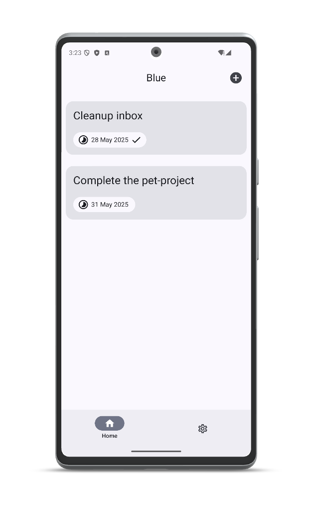

# BlueDays

BlueDays is a sample goal-tracking Android app demonstrating the use of Jetpack Compose and Material 3. It allows users to create, edit, and track their goals with a modern and intuitive interface.

## Features
- Create, edit, and delete goals
- Track completion status
- Set due dates for each goal
- Modern Material 3 UI

## App Mockup

Below is a preview of the app interface:



### Build & Run
1. Clone this repository:
   ```sh
   git clone https://github.com/slateblua/bluedays.git
   ```
2. Open the project in Android Studio.
3. Click **Run** to build and launch the app on your device or emulator.
